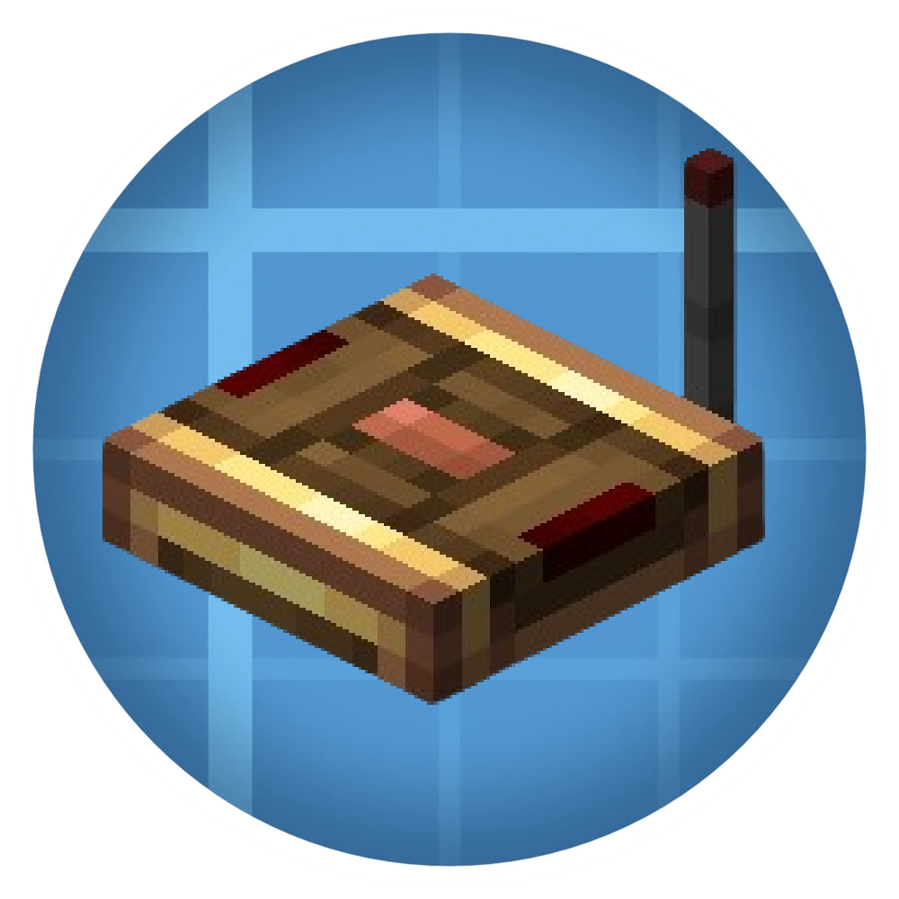

  

# **Create: Frequency**

**A powerful wireless utility for the Create mod.**

---

### **Overview**
**Create: Frequency** is an addon for [Create](https://github.com/Creators-of-Create/Create) that adds a wireless communication system based on frequencies. It allows for seamless remote interaction and organized network management across your entire world.
### **Requirements**
To ensure compatibility, please use the following versions:

* **Minecraft:** `1.21.1`
* **NeoForge:** `21.1.208` or higher
* **Create:** `6.0.6` or higher

---

### **Resources**
* 📦 **Modrinth:** [Project Page](https://modrinth.com/project/create-frequency)
* 🔥 **Curseforge:** [Project Page](https://legacy.curseforge.com/minecraft/mc-mods/create-frequency)
* 🛠️ **Issue Tracker:** [Report a Bug](https://github.com/ripiters/Create-Frequency-1.21.1/issues)
* 📜 **License:** MIT

---

  Built with passion for the Create Mod community.

